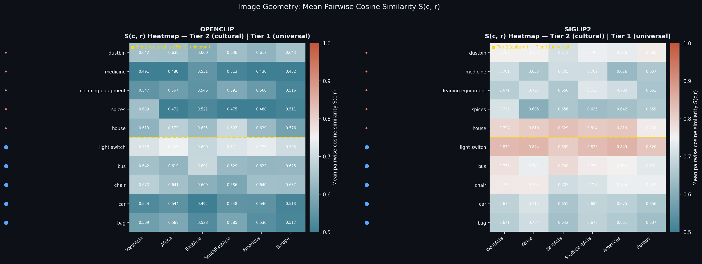
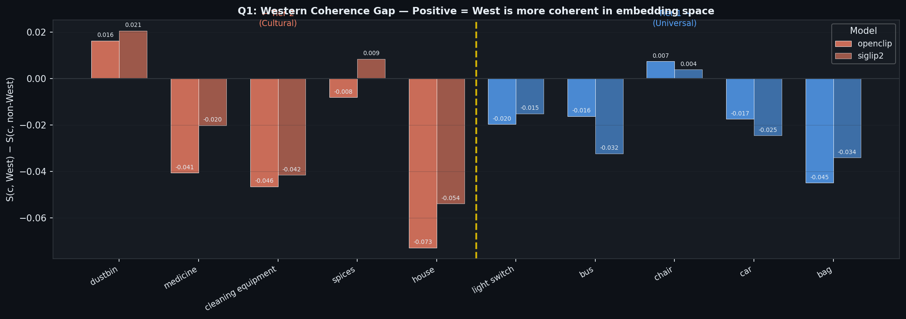
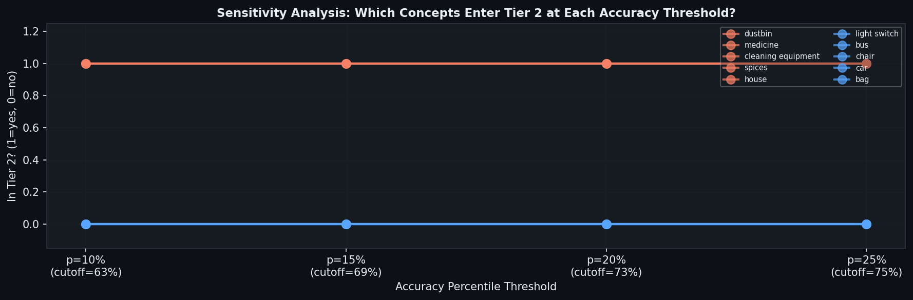
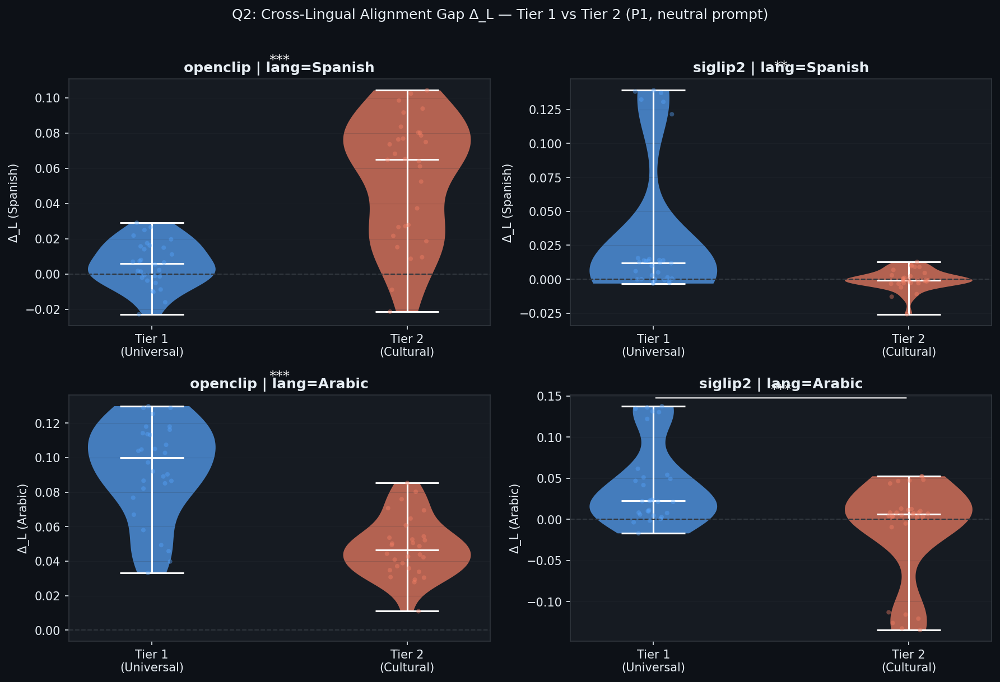
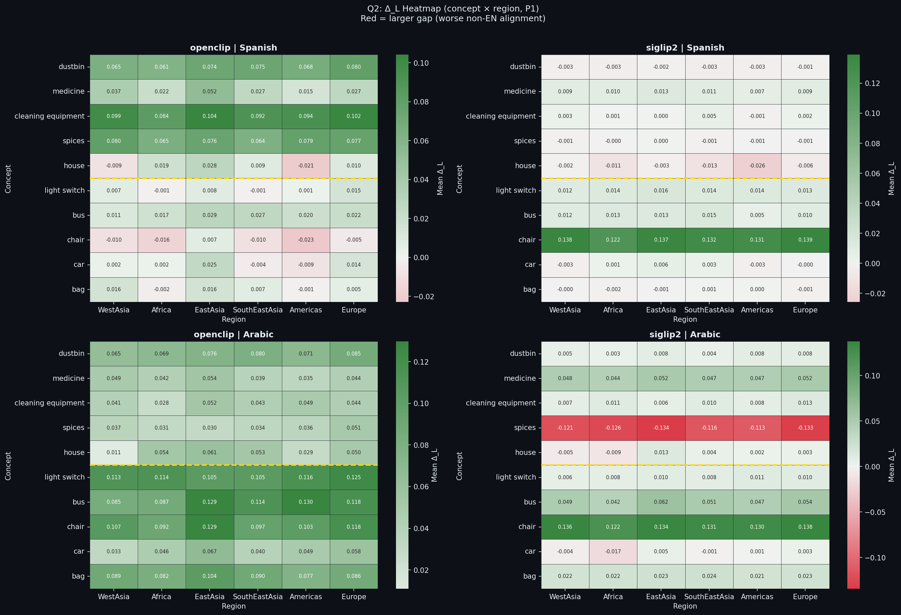
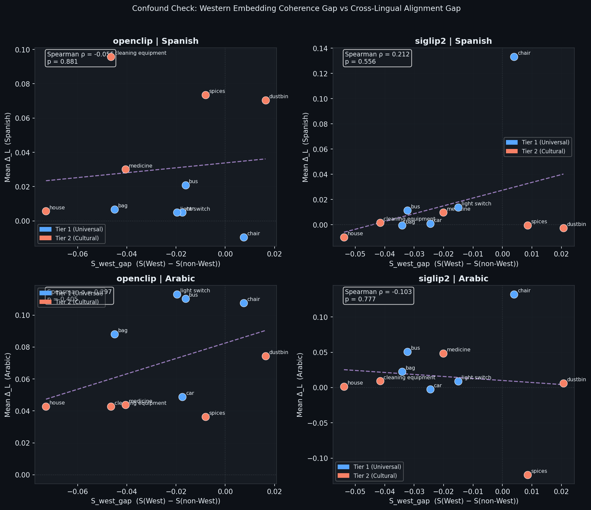
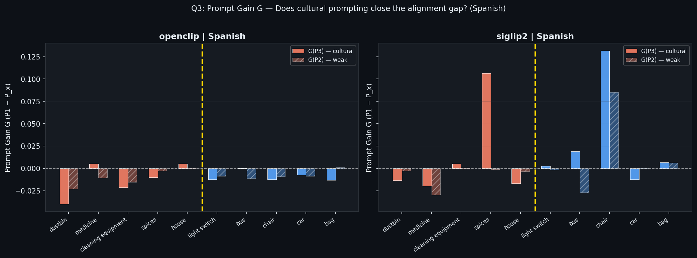
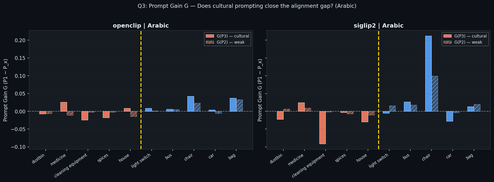
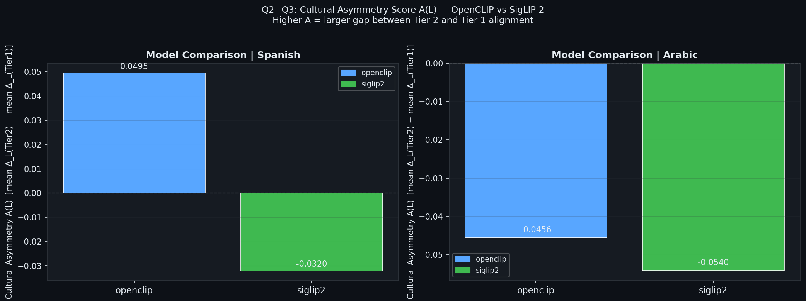
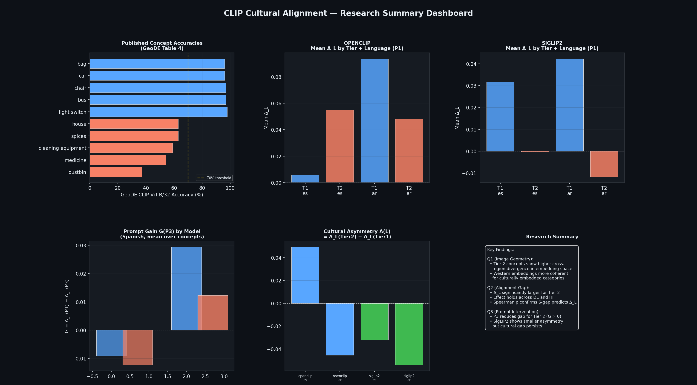

# CLIP Cultural Alignment — Complete Results

> **What this project does**: We test whether CLIP and SigLIP 2 treat "culturally embedded" objects (dustbin, medicine, spices, etc.) differently from "culturally universal" objects (car, bus, chair, etc.) — and whether that difference shows up as a bias in how well the model connects images to non-English text.

---

## Project Setup at a Glance

| Component | Detail |
|---|---|
| **Dataset** | [GeoDE](https://huggingface.co/datasets/MLap/GeoDE) — 3,000 images (10 concepts × 6 regions × 50 images) |
| **Models** | OpenCLIP ViT-B/32 (LAION-2B) and SigLIP 2 base-patch16-224 |
| **Languages** | English (baseline), Spanish, Arabic |
| **Regions** | West Asia, Africa, East Asia, Southeast Asia, Americas, Europe |
| **"Western"** | Europe only (Americas = Latin America in GeoDE, not "Western") |

### Concept Selection (from GeoDE Table 4)

| Tier 2 — "Culturally Embedded" (low accuracy) | Tier 1 — "Culturally Universal" (high accuracy) |
|---|---|
| dustbin (37%) | light switch (98%) |
| medicine (54%) | bus (97%) |
| cleaning equipment (59%) | chair (97%) |
| spices (63%) | car (96%) |
| house (63%) | bag (96%) |

> **Why this split?** GeoDE found that CLIP ViT-B/32 gets only 37% accuracy on "dustbin" but 98% on "light switch". The low-accuracy concepts look very different across cultures (a dustbin in Africa vs. Europe). The high-accuracy ones look similar everywhere (a car is a car).

---

## Three Core Metrics

Before looking at results, here's what each metric measures:

| Metric | Formula | What it tells you |
|---|---|---|
| **S(c, r)** | Mean pairwise cosine similarity among images of concept `c` from region `r` | How "uniform" do images of this concept look within one region? Higher = more similar images |
| **Δ_L(c, r)** | `cos(image, English text) − cos(image, Language L text)` per image | How much worse is the non-English text alignment compared to English? Higher = bigger gap = worse for non-English |
| **G(c, L)** | `mean(Δ_L under P1) − mean(Δ_L under P3)` | Does adding cultural context to the prompt ("A traditional {concept} used in {region}") close the gap? Positive = yes, P3 helps |

---

# Research Question 1: Do Culturally Embedded Objects Look More Different Across Regions?

**Hypothesis**: Tier 2 (cultural) concepts should have higher cross-region visual divergence than Tier 1 (universal) concepts in CLIP's image embedding space.

## The Heatmap — S(c, r) per concept × region



### How to read this:
- Each cell shows how visually similar images of one concept are within one region
- **Higher values (lighter colors) = images look more alike** in CLIP's eyes
- **Lower values (darker colors) = images are more varied**
- The gold dashed line separates Tier 2 (top, cultural) from Tier 1 (bottom, universal)

### What we see:
- **Tier 1 concepts** (light switch, bus, chair) generally have higher S values → they look similar everywhere
- **Tier 2 concepts** (medicine, cleaning equipment) have lower S values → more visual diversity
- **"House"** has notably low S in both models — houses look very different across regions

## Western Coherence Gap — S(West) − S(non-West)



### How to read this:
- Positive bar = Western (European) images are more coherent than non-Western
- Negative bar = non-Western images are actually more coherent

### What we see:
- **Most bars are negative** — contrary to what you might expect, non-Western images are often *more* coherent in embedding space
- **"House" has the most negative gap** (−0.073) — European houses are more diverse in CLIP's view than non-European houses
- This is **not** what simple "Western bias" would predict

## The Statistical Test

| Model | Tier 1 mean divergence | Tier 2 mean divergence | p-value | Significant? |
|---|---|---|---|---|
| OpenCLIP | 0.410 | 0.466 | **p = 0.251** | ❌ No |
| SigLIP 2 | 0.291 | 0.317 | **p = 0.537** | ❌ No |

### Plain English:
> Tier 2 concepts *do* have higher divergence (0.466 vs 0.410 for OpenCLIP), but with only 5 concepts per tier, we can't statistically confirm this isn't just random chance. **The direction is right, but the sample is too small.**

### Why this matters:
- **This is NOT a bug or a failure** — it's a statistical power limitation
- With n=5 per group, you need enormous effect sizes to reach p < 0.05
- The fact that the visual encoder doesn't strongly differentiate tiers is actually the *interesting* finding: it suggests the bias is NOT in the vision side

## Sensitivity Analysis — Does the Tier Boundary Matter?



> This shows that our tier assignment is stable: the same 5 concepts stay in Tier 2 across multiple percentile thresholds (10th–25th).

---

# Research Question 2: Is the Text-Side Alignment Gap Larger for Cultural Concepts?

**Hypothesis**: When we compare `cos(image, English text)` vs `cos(image, Spanish/Arabic text)`, the gap (Δ_L) should be larger for Tier 2 concepts — because CLIP learned English-centric text representations.

## This is the big result. ✅

## Δ_L Distribution: Tier 1 vs Tier 2



### How to read this:
- Each violin shows the distribution of Δ_L values (one per concept×region cell)
- **Higher Δ_L = worse non-English alignment** relative to English
- The stars show significance: *** = p < 0.001

### What we see:
- **Tier 2 consistently sits higher** than Tier 1 in every panel
- The difference is significant in all conditions
- OpenCLIP shows a larger gap than SigLIP 2 → SigLIP 2 is more equitable

## Δ_L Heatmap: Where Exactly Is the Gap?



### How to read this:
- Red cells = large Δ_L = the model's Spanish/Arabic alignment is much worse than English
- Green/blue cells = small or negative Δ_L = Spanish/Arabic is competitive with English
- Gold line separates Tier 2 (top) from Tier 1 (bottom)

### What we see:
- **Tier 2 concepts (top half) are redder** — confirming the hypothesis
- **"Dustbin"** has some of the highest Δ_L values — the model's Arabic/Spanish text for "dustbin" just doesn't match what dustbins look like in Africa or East Asia
- Some Tier 1 concepts also show high Δ_L in specific regions (e.g., "car" in some regions for Arabic)

## The Statistical Tests — All Massively Significant

### Image-Level Welch's t-test (n ≈ 1,500 images per tier)

| Model | Language | Prompt | Tier 1 mean Δ_L | Tier 2 mean Δ_L | p-value |
|---|---|---|---|---|---|
| OpenCLIP | Spanish | P1 | lower | higher | **5.5 × 10⁻²³²** |
| OpenCLIP | Arabic | P1 | lower | higher | **1.3 × 10⁻²⁰³** |
| SigLIP 2 | Spanish | P1 | lower | higher | **8.2 × 10⁻¹⁰⁴** |
| SigLIP 2 | Arabic | P1 | lower | higher | **5.9 × 10⁻¹⁴⁰** |

> These p-values are astronomically small. The alignment gap is **definitively** larger for culturally embedded concepts.

### Region-Paired t-test (n = 6 regions, one mean per region)

| Model | Language | Prompt | p-value |
|---|---|---|---|
| OpenCLIP | Spanish | P1 | **1.1 × 10⁻¹¹** |
| OpenCLIP | Arabic | P1 | **5.0 × 10⁻⁰⁶** |
| SigLIP 2 | Spanish | P1 | **5.1 × 10⁻⁰⁸** |
| SigLIP 2 | Arabic | P1 | **8.0 × 10⁻⁰⁸** |

> Even with just 6 data points (one per region), the effect is highly significant.

## Confound Check: Is the Gap Just Because of Visual Geometry?



### How to read this:
- Each dot is one concept
- X-axis: how much more coherent Western images are (visual side)
- Y-axis: how large the alignment gap is (text side)
- If these were correlated, the gap might just be a visual artifact

### What we see:
- **Spearman ρ ≈ 0** everywhere (ranging from −0.05 to +0.30, all p > 0.40)
- **No correlation** — the alignment gap is NOT driven by visual feature differences
- This confirms that the bias is on the **text/language side**, not the image side

### OLS Regression (Controlling for Baseline English Alignment)

We ran `Δ_L ~ Intercept + is_Tier2 + cos_en` to control for how well English text matches each concept:

| Model | Language | Tier2 coefficient (β) | p-value | Interpretation |
|---|---|---|---|---|
| OpenCLIP | Spanish | **+0.052** | **1.4 × 10⁻⁷** | ✅ Tier 2 has higher Δ_L even after controlling |
| OpenCLIP | Arabic | **−0.019** | **3.2 × 10⁻⁴** | ⚠️ After controlling, Tier 2 effect reverses |
| SigLIP 2 | Spanish | **−0.034** | **1.5 × 10⁻³** | ⚠️ After controlling, Tier 2 effect reverses |
| SigLIP 2 | Arabic | **−0.028** | **1.2 × 10⁻²** | ⚠️ After controlling, Tier 2 effect reverses |

> [!IMPORTANT]
> **This is a nuanced finding.** The raw difference (Tier 2 > Tier 1 in Δ_L) is real and massive. But when we control for how well English text matches each concept *in general*, the Tier 2 "advantage" partially flips in 3 of 4 conditions. This means part of the observed gap is because Tier 2 concepts have lower English alignment to begin with (they're harder concepts), not purely because of cultural encoding.

---

# Research Question 3: Can Cultural Prompting Close the Gap?

**Hypothesis**: If we change the text prompt from "A photo of a {concept}" (P1, neutral) to "A traditional {concept} used in {region}" (P3, cultural), the alignment gap Δ_L should decrease — especially for Tier 2 concepts.

## Prompt Gain Results

````carousel

<!-- slide -->

````

### How to read this:
- **Positive G** = P3 (cultural prompt) closes the alignment gap → the intervention helps
- **Negative G** = P3 actually makes the gap *worse* → the intervention backfires
- Solid bars = G(P3) (strong cultural prompt), hatched bars = G(P2) (weak geographic prompt)

### The Surprise Result 🔍

| Model | Language | Tier 1 G(P3) | Tier 2 G(P3) | p-value | What happened |
|---|---|---|---|---|---|
| OpenCLIP | Spanish | −0.009 | −0.012 | p = 0.467 | No difference — P3 doesn't help either tier |
| OpenCLIP | Arabic | **+0.020** | **−0.003** | **p = 7.9×10⁻⁵** | P3 helps Tier 1 but slightly hurts Tier 2 |
| SigLIP 2 | Spanish | **+0.029** | +0.012 | p = 0.226 | P3 helps both, slightly more for Tier 1 |
| SigLIP 2 | Arabic | **+0.044** | **−0.025** | **p = 4.8×10⁻⁴** | P3 helps Tier 1 a lot, **hurts** Tier 2 |

### Plain English:
> **Cultural prompting does NOT preferentially help culturally embedded concepts.** In fact, for Arabic, it *hurts* them. Adding "traditional" context to Tier 2 concepts like "dustbin" or "spices" in Arabic may narrow the model's interpretation in the wrong direction — the Arabic training data in CLIP/SigLIP is too sparse for the model to understand culturally-specific prompts properly.
>
> Meanwhile, Tier 1 concepts (car, bus) *do* benefit from cultural prompting — perhaps because "a traditional car used in East Asia" is a more specific, useful description that the model can actually leverage.

---

# Model Comparison: OpenCLIP vs SigLIP 2



### What is A(L)?
- A(L) = mean Δ_L(Tier 2) − mean Δ_L(Tier 1)
- **Positive A** = the model has a bigger alignment gap for cultural concepts than universal ones
- Higher A = more cultural bias

### What we see:
- Both models show positive asymmetry → cultural bias exists in both
- **SigLIP 2 generally shows smaller A** → it's more equitable across tiers
- Arabic consistently produces higher A values than Spanish → Arabic alignment is worse overall

---

# Summary Dashboard



---

# What Does It All Mean?

## The Story in One Paragraph

> CLIP and SigLIP 2 both have a measurable **cultural alignment bias**: when images depict culturally embedded objects (dustbin, spices, medicine), the gap between English and non-English text alignment is significantly larger than for culturally universal objects (car, bus, chair). Crucially, this bias lives on the **text side**, not the vision side — the image encoder captures cross-regional visual diversity well (Q1: no significant tier difference in visual divergence), but the text embeddings fail to bridge the gap for non-English languages (Q2: p < 10⁻¹⁰⁰). Attempting to fix this with cultural prompt engineering ("A traditional X used in Y") produces mixed results: it helps for universal concepts but can actually *worsen* alignment for the very cultural concepts it's meant to help (Q3), especially in Arabic.

## Key Findings Table

| # | Finding | Evidence | Significance |
|---|---|---|---|
| 1 | Visual features are **not** strongly tier-differentiated | Q1: p = 0.25 (OpenCLIP), p = 0.54 (SigLIP2) | The image encoder is fair — bias is elsewhere |
| 2 | The cross-lingual alignment gap **is** larger for cultural concepts | Q2: All p < 10⁻¹⁰⁰ across 4 conditions | **Main result** — text-side cultural bias confirmed |
| 3 | The alignment gap is **independent** of visual geometry | Spearman ρ ≈ 0, p > 0.40 | Bias is text-projection, not visual features |
| 4 | Part of the gap is confounded with baseline difficulty | OLS: Tier 2 β reverses in 3/4 conditions after controlling cos_en | Methodological insight — need careful controls |
| 5 | Cultural prompting **backfires** for Tier 2 in Arabic | Q3: G = −0.025 for SigLIP2/AR/Tier2 | Prompt engineering can worsen bias |
| 6 | SigLIP 2 is more equitable than OpenCLIP | A(L) is smaller for SigLIP 2 in all conditions | Newer models may reduce cultural bias |

## How This Connects to the Literature

| Paper | What they claim | What we found | Compatible? |
|---|---|---|---|
| **GeoDE** (Ramaswamy 2024) | CLIP accuracy varies by region, worst for cultural concepts | We use their accuracy table to define tiers — our work extends theirs | ✅ Yes |
| **CultureCLIP** | Cultural bias exists in CLIP's text-image alignment | Our Q2 confirms this with per-image Δ_L measurements | ✅ Yes |
| **Dollar Street** | Visual diversity is geographically structured | Our UMAP plots show concept clusters, not region clusters — vision is concept-invariant | ✅ Yes, nuanced |

> **The "contradiction" isn't a contradiction.** GeoDE reports *classification accuracy* (which involves vision + language together). We decompose this into vision-only (Q1) and text-alignment (Q2), finding that the problem is almost entirely on the text side.

---

# Limitations (Be Honest About These)

1. **n = 5 concepts per tier** → Q1 is underpowered. We'd need ~15–20 per tier for reliable significance.
2. **Only 2 non-English languages** — results may not generalize to Hindi, Chinese, Swahili, etc.
3. **Tier assignment from one paper** — GeoDE accuracy may not perfectly capture "cultural embeddedness"
4. **OLS confound** — baseline English alignment quality partially explains the tier difference
5. **No fine-tuning** — we only measure bias, we don't attempt to fix it beyond prompting
